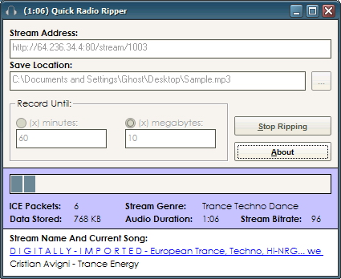



## Shoutcast Stream Ripper

### Description

One of the best Shoutcast Stream-Ripping Applications available on PSC for Visual Basic. The Quick Ripper is capable of connecting to any specified shoutcast stream and downloading it - MP3 data only, no polluting ICE tags left over - and recording it to an MP3 file on disk. It can record until a certain time elapses, or a certain file size is reached. I've tested it with a 3 hour rip and it came out beautifully. It can be started from command line also, making it perfect for scheduling routine rips with your favorite scheduler software. Stream Buffering decreases the number of block writes to disk are required. Live Resync protects streams from becoming corrupted mid-run, the ripper will simply wait for the next ICE tag and use it to reanchor and resync with minimal audio loss. Entirely coded from scratch, capture routines revolve around straight winsock access.
 
### More Info
 

             |
---                |---
**Submitted On**   |2006-03-10 18:24:36
**By**             |[Coder\_Ghost](https://github.com/Planet-Source-Code/PSCIndex/blob/master/ByAuthor/coder-ghost.md)
**Level**          |Advanced
**User Rating**    |5.0 (45 globes from 9 users)
**Compatibility**  |VB 6\.0
**Category**       |[Complete Applications](https://github.com/Planet-Source-Code/PSCIndex/blob/master/ByCategory/complete-applications__1-27.md)
**World**          |[Visual Basic](https://github.com/Planet-Source-Code/PSCIndex/blob/master/ByWorld/visual-basic.md)
**Archive File**   |[Shoutcast\_1979773122006\.zip](https://github.com/Planet-Source-Code/coder-ghost-shoutcast-stream-ripper__1-64608/archive/master.zip)

